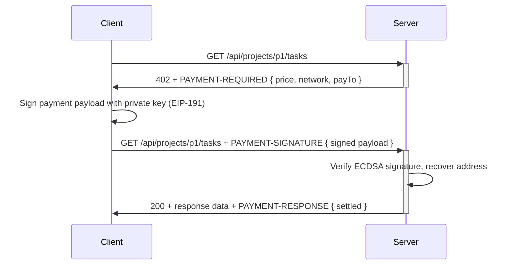

# TaskFlow — Team Task Management API

A team task management API (similar to Asana / Jira) built in Go. Features REST endpoints for creating, assigning, and tracking tasks, protected by the **x402 payment protocol** (HTTP 402 Payment Required) for external tool and AI agent access.

## Architecture

```
handlers (main.go)
  └── service.TaskService    ← business logic, validation
        └── storage.TaskStore ← persistence interface (swap for PostgreSQL)
              └── InMemoryTaskStore

middleware/
  └── x402 middleware        ← payment gating (HTTP 402)
        └── verifier         ← ECDSA / EIP-191 signature verification
```

## Quick start

```bash
go run main.go
# Open http://localhost:8080 for the Web UI
# Use the /api/* endpoints for programmatic access (requires x402 payment)
```

## Project structure

```
TaskFlow/
├── main.go                   ─  Server entrypoint, route wiring, API handlers
├── middleware/
│   ├── x402.go               ─  x402 payment middleware (HTTP 402)
│   ├── x402_test.go          ─  Tests for the middleware
│   └── verifier.go           ─  Real ECDSA/EIP-191 signature verification
├── service/
│   └── task.go               ─  TaskService (business logic layer)
├── storage/
│   └── task.go               ─  Task model + InMemoryTaskStore
├── static/
│   ├── css/style.css
│   └── js/app.js
├── *.html                    ─  Web UI templates
├── go.mod / go.sum
└── README.md
```

## Web UI Routes (browser)

| Method | Path                          | Page                   |
|--------|-------------------------------|------------------------|
| GET    | /login                        | Login form             |
| POST   | /login                        | Authenticate           |
| GET    | /register                     | Registration form      |
| POST   | /register                     | Create account         |
| POST   | /logout                       | Clear session          |
| GET    | /dashboard                    | Task dashboard         |
| GET    | /tasks                        | Task list              |
| POST   | /tasks                        | Create task (HTML)     |
| GET    | /tasks/{id}                   | Task detail            |
| POST   | /tasks/{id}                   | Update task            |
| POST   | /tasks/{id}/delete            | Delete task            |
| POST   | /tasks/{id}/attachments       | Upload attachment      |
| GET    | /upload                       | Upload page            |
| POST   | /upload                       | Handle upload          |
| GET    | /profile                      | Profile page           |
| POST   | /profile                      | Update profile         |
| POST   | /profile/password             | Change password        |
| POST   | /profile/avatar               | Upload avatar          |
| GET    | /static/*                     | Static assets          |

---

# x402 API — Client Documentation

This section explains how external tools and AI agents interact with TaskFlow's payment-gated API endpoints.

## Overview

TaskFlow uses the [x402 protocol](https://x402.org) to gate API access. Instead of API keys or login sessions, each request carries a **cryptographically signed payment payload** proving the caller has paid.

**Flow:**
1. Client sends a request to a protected endpoint **without** payment → gets **HTTP 402** + `PAYMENT-REQUIRED` header
2. Client pays (via an Ethereum wallet or facilitator) and constructs a signed `PaymentPayload`
3. Client retries with a `PAYMENT-SIGNATURE` header → server verifies → proceeds if valid



---

## Protected Endpoints

All API endpoints are prefixed with `/api` and protected by the x402 middleware:

| Method   | Path                          | Description                  | Price   |
|----------|-------------------------------|------------------------------|---------|
| `POST`   | `/api/tasks`                  | Create a new task            | $0.001  |
| `GET`    | `/api/projects/{id}/tasks`    | List all tasks for a project | $0.001  |
| `PUT`    | `/api/tasks/{id}`             | Update an existing task      | $0.001  |
| `DELETE` | `/api/tasks/{id}`             | Delete a task                | $0.001  |

> Current price: **$0.001 USDC** on **Base (eip155:84532)**.
> Configurable via `X402Config` in `main.go`.

---

## Step-by-Step Client Guide

### 1. Make an unpaid request to see what's required

```
GET /api/projects/proj-123/tasks
```

**Response:**
```
HTTP/1.1 402 Payment Required
PAYMENT-REQUIRED: eyJzY2hlbWUiOiJleGFjdCIsImFtb3VudCI6IiQwLjAwMSIsImN1cnJlbmN5IjoiVVNEQyIsIm5ldHdvcmsiOiJlaXAxNTU6ODQ1MzIiLCJwYXlUbyI6IjB4VGFza0Zsb3dQYXlUb0FkZHJlc3MiLCJyZXF1ZXN0SWQiOiJHRVQgL2FwaS9wcm9qZWN0cy97aWR9L3Rhc2tzIDIifQ==
Content-Type: application/json

{
  "error": "payment_required",
  "message": "This endpoint requires payment via the x402 protocol. See https://x402.org",
  "payment_required": {
    "scheme": "exact",
    "amount": "$0.001",
    "currency": "USDC",
    "network": "eip155:84532",
    "payTo": "0xTaskFlowPayToAddress",
    "requestId": "GET /api/projects/{id}/tasks ..."
  }
}
```

The `PAYMENT-REQUIRED` header is a **base64-encoded JSON** object. Decode it to see the exact payment terms:

```bash
# Decode the header with base64
cat <<< "eyJzY2hlbWUiOiJleGFjdCIsImFtb3VudCI6IiQwLjAwMSIsImN1cnJlbmN5IjoiVVNEQyIsIm5ldHdvcmsiOiJlaXAxNTU6ODQ1MzIiLCJwYXlUbyI6IjB4VGFza0Zsb3dQYXlUb0FkZHJlc3MiLCJyZXF1ZXN0SWQiOiJHRVQgL2FwaS9wcm9qZWN0cy97aWR9L3Rhc2tzIDIifQ==" | base64 -d
```

### 2. Construct the Payment Payload

The payment payload is a JSON object with these fields (all required):

| Field       | Type   | Description                              |
|-------------|--------|------------------------------------------|
| `scheme`    | string | Payment scheme — must be `"exact"`       |
| `amount`    | string | Price from PAYMENT-REQUIRED, e.g. `"$0.001"` |
| `currency`  | string | e.g. `"USDC"`                            |
| `network`   | string | e.g. `"eip155:84532"`                    |
| `requestId` | string | Echoed from the PAYMENT-REQUIRED header  |
| `sender`    | string | Your Ethereum wallet address (0x-prefixed) |
| `signature` | string | **EIP-191 signature** of the fields above (without signature field) — see next step |

### 3. Sign the Payload (EIP-191)

The signature is an **ECDSA signature over secp256k1** using [EIP-191](https://eips.ethereum.org/EIPS/eip-191) (Ethereum Signed Message).

**Message to sign** is the canonical JSON of these fields in this exact order:

```json
{"scheme":"exact","amount":"$0.001","currency":"USDC","network":"eip155:84532","requestId":"...","sender":"0x..."}
```

**Signing process:**
1. Serialize the fields (minus `signature`) to JSON — field order must match exactly
2. Prepend the EIP-191 prefix: `"\x19Ethereum Signed Message:\n" + len(json) + json`
3. Hash with Keccak256
4. Sign with your Ethereum private key to produce a **65-byte `[R, S, V]` signature**
5. Encode as a 0x-prefixed hex string (130 hex chars)

### 4. Send the signed request

Encode the full payload (including the signature) as **base64** and send it in the `PAYMENT-SIGNATURE` header:

```
PAYMENT-SIGNATURE: eyJzY2hlbWUiOiJleGFjdCIsImFtb3VudCI6IiQwLjAwMSIsImN1cnJlbmN5IjoiVVNEQyIsIm5ldHdvcmsiOiJlaXAxNTU6ODQ1MzIiLCJyZXF1ZXN0SWQiOiJHRVQgL2FwaS9wcm9qZWN0cy97aWR9L3Rhc2tzIiwic2lnbmF0dXJlIjoiMHgwMDAwMDAwMDAwMDAwMDAwMDAwMDAwMDAwMDAwMDAwMDAwMDAwMDAwMDAwMDAwMDAwMDAwMDAwMDAwMDAwMDAwMDAwMDAwMDAwMDAwMDAwMDAwMDAwMDAwMDAwMDAwMDAwMDAwMDAwMDAwMDAwMDAwMDAwMDAwMDAwMDAwMDAwMDAwMDAwMDAwMDAwMDAwMDAwMDAwMDAwMDAwMDAwMDAwMDAwMDAwMDAwMDAwMDAwMDAwMDAwMDAwMDAwMDAwMDAwMDAwMDAwMDAwMDAwMDAwMDAwMDAwMDAwMDAwMDAwMDAwMDAwMDAwMDAwMDAwMDAwMDAwMDAwMDAwMDAwMDAwMDAwMDAwMDAwMDAwMDAwMDAwMDAwMDAwMDAwMDAwMDAwMDAwMDAwMDAwMDAwMDAwMDAwMDAwMDAwMDAwMDAwMDAwMDAwMDAwMDAwMDAwMDAwMDAwMDAwMDAwMDAwMDAwMDAwMDAwMDAwMDAwMDAwMDAwMDAwMDAwMDAwMDAwMDAwMDAwMDAwMDAwMDAwMDAwMDAwMDAwMDAwMDAwMDAwMDAwMDAwMDAwMDAwMDAwMDAwIn0=
```

### 5. Handle the response

On **valid payment**, the server returns your data with a `PAYMENT-RESPONSE` header:

```
HTTP/1.1 200 OK
PAYMENT-RESPONSE: eyJzdGF0dXMiOiJzZXR0bGVkIiwidHJhbnNhY3Rpb25JZCI6Im1vY2stdHgtUE9TVCAvYXBpL3Rhc2tzIDIifQ==
Content-Type: application/json

{
  "id": "task-1",
  "title": "...",
  ...
}
```

Decode `PAYMENT-RESPONSE` to see settlement details:

```json
{
  "status": "settled",
  "transactionId": "mock-tx-..."
}
```

> In production, `transactionId` would be the on-chain transaction hash.

On **invalid payment**, you get **402** with a `PAYMENT-RESPONSE` header indicating failure:

```json
{
  "status": "failed",
  "error": "invalid_signature"
}
```

See [Error Reference](#error-reference) for all error codes.

---

## Code Examples

### curl

```bash
#!/bin/bash

# 1. Construct the payment payload (use your actual signature!)
#    See "Sign the Payload" section above for how to generate this.
read -r -d '' PAYLOAD <<'PAYLOAD'
{
  "scheme": "exact",
  "amount": "$0.001",
  "currency": "USDC",
  "network": "eip155:84532",
  "requestId": "GET /api/projects/proj-123/tasks 1690828800000000000",
  "signature": "0x...",
  "sender": "0xYourEthereumAddress"
}
PAYLOAD

# 2. Base64 encode the payload
PAYMENT_SIGNATURE=$(echo -n "$PAYLOAD" | base64 -w0)

# 3. Make the API call
curl -v http://localhost:8080/api/projects/proj-123/tasks \
  -H "PAYMENT-SIGNATURE: $PAYMENT_SIGNATURE"
```

### JavaScript / TypeScript (using ethers.js)

```typescript
import { ethers } from "ethers";

interface PaymentPayload {
  scheme: string;
  amount: string;
  currency: string;
  network: string;
  requestId: string;
  signature: string;
  sender: string;
}

async function callWithPayment(
  url: string,
  method: string,
  body?: object
): Promise<Response> {
  // 1. First, make an unpaid request to trigger 402
  const initialRes = await fetch(url, { method });

  if (initialRes.status !== 402) {
    return initialRes; // Not protected or already paid
  }

  // 2. Parse the PAYMENT-REQUIRED header
  const paymentRequired = JSON.parse(
    atob(initialRes.headers.get("PAYMENT-REQUIRED")!)
  );

  // 3. Connect wallet and sign
  const provider = new ethers.BrowserProvider(window.ethereum);
  const signer = await provider.getSigner();
  const sender = await signer.getAddress();

  // Build the message to sign (canonical JSON, field order matters!)
  const messageObj = {
    scheme: paymentRequired.scheme,
    amount: paymentRequired.amount,
    currency: paymentRequired.currency,
    network: paymentRequired.network,
    requestId: paymentRequired.requestId,
    sender,
  };
  const message = JSON.stringify(messageObj);

  // Sign with EIP-191 (ethers does this automatically)
  const signature = await signer.signMessage(message);

  // 4. Build the full payload and send
  const payload: PaymentPayload = {
    ...messageObj,
    signature,
    sender,
  };

  const headers: Record<string, string> = {
    "PAYMENT-SIGNATURE": btoa(JSON.stringify(payload)),
    "Content-Type": "application/json",
  };

  return fetch(url, {
    method,
    headers,
    body: body ? JSON.stringify(body) : undefined,
  });
}

// Example usage
async function createTask() {
  const res = await callWithPayment(
    "http://localhost:8080/api/tasks",
    "POST",
    { title: "Build feature", description: "...", project_id: "proj-1", assignees: ["0x..."] }
  );
  console.log(await res.json());
}
```

### Python (using web3.py)

```python
import json
import base64
from web3 import Web3
from eth_account.messages import encode_defunct

def create_signed_payload(
    private_key: str,
    payment_required: dict,
    sender: str,
) -> str:
    """Build a signed PaymentPayload and return base64-encoded JSON."""
    
    # Fields must be in this exact order!
    message_obj = {
        "scheme": payment_required["scheme"],
        "amount": payment_required["amount"],
        "currency": payment_required["currency"],
        "network": payment_required["network"],
        "requestId": payment_required["requestId"],
        "sender": sender,
    }
    
    message = json.dumps(message_obj, separators=(",", ":"))
    
    # Create EIP-191 signed message
    w3 = Web3()
    message_hash = encode_defunct(text=message)
    signed = w3.eth.account.sign_message(message_hash, private_key=private_key)
    
    # Build the full payload
    payload = {**message_obj, "signature": signed.signature.hex()}
    
    # Return base64-encoded JSON
    return base64.b64encode(json.dumps(payload).encode()).decode()


# Example usage with requests
def get_project_tasks(server_url: str, project_id: str, private_key: str, sender: str):
    import requests

    # Step 1: Trigger 402 (unpaid request)
    url = f"{server_url}/api/projects/{project_id}/tasks"
    resp = requests.get(url)

    if resp.status_code != 402:
        return resp.json()

    # Step 2: Decode PAYMENT-REQUIRED
    payment_required = json.loads(
        base64.b64decode(resp.headers["PAYMENT-REQUIRED"])
    )

    # Step 3: Sign and retry
    sig_header = create_signed_payload(private_key, payment_required, sender)
    
    retry = requests.get(url, headers={"PAYMENT-SIGNATURE": sig_header})
    return retry.json()
```

### Go (for Go-based agents)

```go
import (
	"bytes"
	"crypto/ecdsa"
	"encoding/base64"
	"encoding/json"
	"fmt"
	"net/http"

	"github.com/ethereum/go-ethereum/common"
	"github.com/ethereum/go-ethereum/crypto"
)

type paymentRequired struct {
	Scheme    string `json:"scheme"`
	Amount    string `json:"amount"`
	Currency  string `json:"currency"`
	Network   string `json:"network"`
	PayTo     string `json:"payTo"`
	RequestID string `json:"requestId"`
}

type paymentPayload struct {
	Scheme    string `json:"scheme"`
	Amount    string `json:"amount"`
	Currency  string `json:"currency"`
	Network   string `json:"network"`
	RequestID string `json:"requestId"`
	Signature string `json:"signature"`
	Sender    string `json:"sender"`
}

// signPayload signs the payment fields with the given private key
// using EIP-191 and returns the full base64-encoded payload.
func signPayload(privKey *ecdsa.PrivateKey, pr paymentRequired) (string, error) {
	sender := crypto.PubkeyToAddress(privKey.PublicKey).Hex()

	msg, _ := json.Marshal(struct {
		Scheme    string `json:"scheme"`
		Amount    string `json:"amount"`
		Currency  string `json:"currency"`
		Network   string `json:"network"`
		RequestID string `json:"requestId"`
		Sender    string `json:"sender"`
	}{
		Scheme:    pr.Scheme,
		Amount:    pr.Amount,
		Currency:  pr.Currency,
		Network:   pr.Network,
		RequestID: pr.RequestID,
		Sender:    sender,
	})

	eip191 := fmt.Sprintf("\x19Ethereum Signed Message:\n%d%s", len(msg), msg)
	hash := crypto.Keccak256Hash([]byte(eip191))

	sig, err := crypto.Sign(hash.Bytes(), privKey)
	if err != nil {
		return "", err
	}

	payload := paymentPayload{
		Scheme:    pr.Scheme,
		Amount:    pr.Amount,
		Currency:  pr.Currency,
		Network:   pr.Network,
		RequestID: pr.RequestID,
		Signature: "0x" + common.Bytes2Hex(sig),
		Sender:    sender,
	}

	b, _ := json.Marshal(payload)
	return base64.StdEncoding.EncodeToString(b), nil
}
```

---

## API Reference

### Create a Task

```http
POST /api/tasks
Content-Type: application/json
PAYMENT-SIGNATURE: <base64-encoded-signed-payload>

{
  "title": "Build login page",
  "description": "Implement OAuth2 login flow",
  "project_id": "proj-42",
  "assignees": ["0xUserAddress"]
}
```

**Response `201 Created`:**
```json
{
  "id": "task-7",
  "title": "Build login page",
  "description": "Implement OAuth2 login flow",
  "status": "open",
  "project_id": "proj-42",
  "assignees": ["0xUserAddress"],
  "created_at": "2026-07-29T21:00:00Z",
  "updated_at": "2026-07-29T21:00:00Z"
}
```

### List Project Tasks

```http
GET /api/projects/{project_id}/tasks
PAYMENT-SIGNATURE: <base64-encoded-signed-payload>
```

**Response `200 OK`:**
```json
{
  "ok": true,
  "project_id": "proj-42",
  "tasks": [
    {
      "id": "task-7",
      "title": "Build login page",
      "status": "open",
      "project_id": "proj-42",
      ...
    }
  ]
}
```

### Update a Task

```http
PUT /api/tasks/{task_id}
Content-Type: application/json
PAYMENT-SIGNATURE: <base64-encoded-signed-payload>

{
  "status": "in-progress",
  "assignees": ["0xNewPerson"]
}
```

All fields are optional. Omitted fields keep their current values.

**Response `200 OK`:** Returns the full updated task object.

### Delete a Task

```http
DELETE /api/tasks/{task_id}
PAYMENT-SIGNATURE: <base64-encoded-signed-payload>
```

**Response `200 OK`:**
```json
{
  "ok": true,
  "task_id": "task-7",
  "status": "deleted"
}
```

---

## Error Reference

| HTTP Status | Error Code              | Description                                  |
|-------------|-------------------------|----------------------------------------------|
| 402         | `payment_required`      | No valid payment attached (initial response) |
| 402         | `invalid_encoding`      | PAYMENT-SIGNATURE is not valid base64        |
| 402         | `invalid_format`        | PAYMENT-SIGNATURE is not valid JSON          |
| 402         | `validation_failed`     | Amount, currency, network, or sender mismatch|
| 402         | `invalid_signature`     | ECDSA signature verification failed          |
| 400         | `bad_request`           | Request body is not valid JSON               |
| 404         | `not_found`             | Task ID does not exist                       |
| 422         | `creation_failed`       | Missing required fields (title, project_id)  |
| 422         | `update_failed`         | Invalid update data                          |
| 500         | `internal_error`        | Unexpected server error                      |

Error responses follow a uniform JSON format:
```json
{
  "error": "not_found",
  "message": "task not found: task-999"
}
```

---

## Configuration

The x402 middleware is configured in `main.go`:

```go
x402Cfg := middleware.X402Config{
	Price:    "$0.001",      // Price per request
	Currency: "USDC",         // Stablecoin
	Network:  "eip155:84532", // Base (Ethereum L2)
	PayTo:    "0xTaskFlowPayToAddress", // Recipient wallet
}
```

Change these values to set your own pricing, currency, or receive address.

---

## Development

```bash
# Run the server
go run main.go

# Run all tests
go test ./... -v

# Run with race detector
go test -race ./...

# Build
go build -o taskflow .
```

### Project pattern

- **Middleware** (`middleware/`) — cross-cutting concerns (payment gating, logging, auth)
- **Service** (`service/`) — business rules, validation
- **Storage** (`storage/`) — data persistence with interface for easy swapping

The `storage.TaskStore` interface can be implemented by a PostgreSQL adapter without changing any handler or service code.
